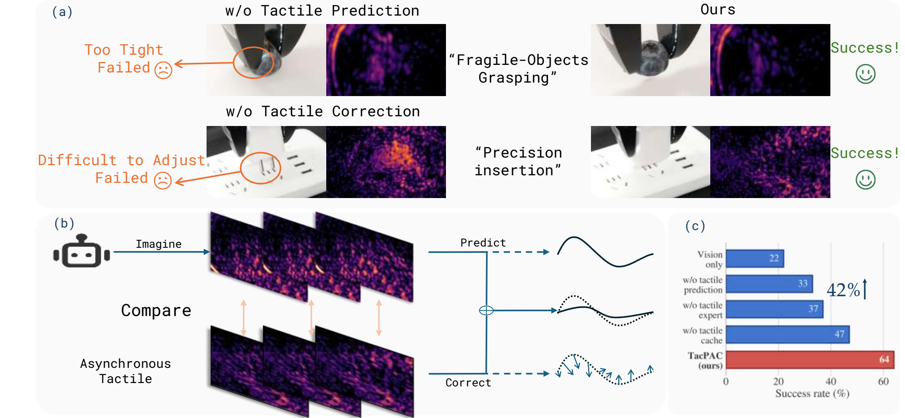
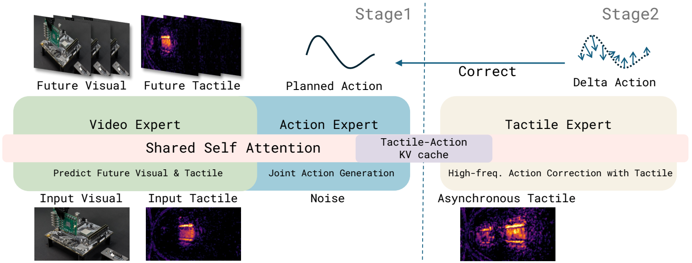

<h1 align="center">🖐️ TacPAC</h1>

<p align="center"><strong>Tactile Prediction and Real-Time Action Correction in World-Action Models<br>for Contact-Rich Manipulation</strong></p>

<p align="center">
  <a href="README-zh.md">中文</a> ·
  <a href="#installation">Installation</a> ·
  <a href="#training">Training</a> ·
  <a href="#inference">Inference</a>
</p>

<p align="center">
  
  <a href="LICENSE"></a>
  
</p>

<p align="center">
  
</p>

TacPAC is a tactile world-action model for contact-rich robot manipulation. A world-action
model can predict the contact that an action chunk is expected to produce, but that prediction is
fixed before execution. TacPAC makes it actionable: while the chunk is running, a tactile expert
reads each newly observed tactile image against the predicted contact and corrects the unexecuted
part of the plan in real time.

The key is a reusable, layer-wise tactile-action KV cache. It stores the predicted tactile contact
and the action representation conditioned on that prediction. Each correction is a single pass
over this cache, so tactile feedback can update an active plan without regenerating the full action
chunk.

> The paper, datasets, and checkpoints are being prepared for public release. This repository
> currently contains the model, training, preprocessing, deployment, and test code.

## ✨ Highlights

- **Prediction-grounded correction.** Current tactile feedback is interpreted against the contact
  anticipated by the plan, rather than as an isolated reactive signal.
- **Asynchronous closed-loop execution.** The base model plans once per chunk; new tactile frames
  update only the unexecuted suffix while the robot keeps moving.
- **Efficient cache reuse.** A tactile correction takes **30.4 ms (32.9 Hz)** in our setup, which is
  **20.7× faster** than regenerating a chunk.
- **Real-robot results.** Across five contact-rich tasks, TacPAC improves average success from
  **22%** for the vision-only base model to **64%**, outperforming the strongest evaluated baseline
  by 16 percentage points.
- **Matched train/deploy tactile processing.** Raw, frame-residual, and stress representations are
  shared by the dataloader and inference server, with modality-aware image resizing.

## 🧠 Method

<p align="center">
  
</p>

TacPAC is trained in two stages:

1. **Tactile-predictive base model.** A video expert predicts future visual and tactile
   observations, while an action expert jointly denoises an action chunk through
   Mixture-of-Transformers attention.
2. **Tactile expert.** The base model is frozen. For each planned chunk, TacPAC caches the clean
   tactile and action keys/values. Training samples execution offsets and supervises a delta action
   on the still-unexecuted suffix.

At inference time, `predict_action()` returns the planned chunk first,
`prefill_tactile_cache()` builds the reusable cache, and every `correct_action()` call applies one
new tactile observation to the active plan.

## 📊 Results

Each method was evaluated over 20 real-world trials per task. TacPAC reaches the best success rate
on all five tasks and averages **64%**. The component study below shows that tactile prediction and
reactive correction are complementary; direct access to the predicted tactile cache provides the
largest final gain.

| Variant | Tactile prediction | Online correction | Tactile cache | Plug | Fruit | Chip | Bottle | Card | Avg. |
| --- | :---: | :---: | :---: | ---: | ---: | ---: | ---: | ---: | ---: |
| Vision only | ✗ | ✗ | — | 15 | 30 | 60 | 5 | 0 | 22 |
| Without tactile expert | ✓ | ✗ | — | 35 | 50 | 65 | 20 | 15 | 37 |
| Without tactile prediction | ✗ | ✓ | ✗ | 40 | 25 | 45 | 30 | 25 | 33 |
| Without tactile cache | ✓ | ✓ | ✗ | 40 | 50 | 75 | **40** | 30 | 47 |
| **TacPAC** | ✓ | ✓ | ✓ | **80** | **65** | **90** | **40** | **45** | **64** |

The five tasks cover charger-plug insertion, multi-object fruit transfer, fragile potato-chip
transfer, empty-bottle uprighting, and expansion-card insertion.

## 🗺️ Code map

| Component | Location |
| --- | --- |
| TacPAC framework and cache/correction flow | `starVLA/model/framework/WM4A/WanMoTJointTacExpert.py` |
| Single-pass tactile expert | `starVLA/model/modules/wan_mot/tactile_expert.py` |
| World-action Mixture-of-Transformers | `starVLA/model/modules/wan_mot/` |
| Tactile preprocessing shared by train and inference | `starVLA/dataloader/vla/tactile_stress.py` |
| LeRobot tactile data loading and execution offsets | `starVLA/dataloader/vla/dataset/` |
| TacPAC training configuration | `starVLA/config/training/vla/starvla_wam.yaml` |
| Stateful `prepare` / `refine` inference protocol | `deployment/model_server/server_infersystem.py` |
| Unit and protocol tests | `scripts/test/test_tactile_*.py`, `scripts/test/test_infersystem_*.py` |

<a id="installation"></a>

## 🛠️ Installation

The code is tested with Python 3.10 and CUDA-capable PyTorch environments.

```bash
git clone git@github.com:LogosRoboticsGroup/TacPAC.git
cd TacPAC

conda create -n tacpac python=3.10 -y
conda activate tacpac

pip install -r requirements.txt
pip install flash-attn --no-build-isolation
pip install -e .
```

Download the Wan2.2 TI2V backbone and update the local model paths in
`starVLA/config/training/vla/starvla_wam.yaml`. In particular, check `dit_path`, `vae_path`,
`text_encoder_path`, and `tokenizer_path` before training.

## 📦 Data preparation

TacPAC expects LeRobot-format demonstrations. A typical Flexiv sample exposes two RGB views and
two tactile views:

```text
observation.images.third_view
observation.images.left_wrist_view
observation.images.left_wrist_left_tactile
observation.images.left_wrist_right_tactile
```

Register local datasets and their `video_keys` in
`starVLA/dataloader/vla/mixtures.py`. Keys containing `tactile` are treated as tactile views, and
stage-2 training emits `tactile_now` / `tactile_offset` samples through
`datasets.vla_data.tactile_offsets_per_sample`.

The private datasets used in the paper are not stored in this repository. Until their release,
replace the example `data_root` entries with paths to your own LeRobot datasets.

Precompute the text embeddings used by both training stages:

```bash
python scripts/vla/precompute_text_embeds.py \
  --config_yaml starVLA/config/training/vla/starvla_wam.yaml \
  --datasets.vla_data.data_mix flexiv_plug_4views \
  --datasets.vla_data.text_embedding_cache_dir data/text_embeds_cache/flexiv_plug_4views
```

<a id="training"></a>

## 🚀 Training

Activate the environment first, then launch the scripts from any directory. The default scripts
use eight processes; set `NPROC_PER_NODE` for another GPU count. Hydra-style overrides can be
appended to either command. Set `TEXT_EMBEDDING_CACHE_DIR` if the cache is not stored under the
default `data/text_embeds_cache/<data_mix>` path.

### 1️⃣ Stage 1: tactile-predictive world-action model

```bash
NPROC_PER_NODE=8 bash scripts/vla/train_WanMoTJoint.sh \
  flexiv_plug_4views \
  stage1
```

### 2️⃣ Stage 2: asynchronous tactile expert

```bash
NPROC_PER_NODE=8 bash scripts/vla/train_WanMoTJoint-TacExpert.sh \
  flexiv_plug_4views \
  results/Checkpoints/vla/<stage1-run>/final_model/pytorch_model.pt
```

Stage 2 freezes the base MoT and proprioceptive encoder, initializes the tactile expert from the
action expert, and trains residual corrections against plans produced by the frozen stage-1 model.

<a id="inference"></a>

## ⚡ Inference

Start the InferSystem server with a TacPAC checkpoint:

```bash
CKPT=results/Checkpoints/vla/<tacpac-run>/final_model/pytorch_model.pt \
PORT=5556 \
bash deployment/local_infer-wan-tac.sh
```

The server exposes a stateful tactile protocol:

- `prepare`: generate a new action chunk and establish a `plan_id`;
- `refine`: send the latest tactile views, execution offset, and executed action prefix to correct
  the remaining actions of that plan.

See `deployment/model_server/README.md` and
`scripts/test/test_infersystem_stateful_tactile.py` for the request schema and reference flow.

## 🧪 Tests

CPU unit tests cover tactile preprocessing, cache geometry, image fitting, and the stateful server
protocol:

```bash
python -m unittest \
  scripts.test.test_tactile_stress \
  scripts.test.test_tactile_expert \
  scripts.test.test_tactile_view_size \
  scripts.test.test_infersystem_stateful_tactile \
  scripts.test.test_infersystem_prefill_order
```

GPU end-to-end smoke tests are available in `scripts/test/smoke_tac_expert_gpu.py` and
`scripts/test/smoke_stateful_tactile_server_gpu.py`.

<a id="acknowledgements"></a>

## 🙏 Acknowledgements

TacPAC is greatly inspired by the following outstanding contributions to the open-source
community: [StarVLA](https://github.com/starVLA/starVLA),
[FastWAM](https://github.com/yuantianyuan01/FastWAM),
[T-Rex](https://github.com/ZhuoyangLiu2005/T-Rex), and
[Dream-Tac](https://github.com/LYFCLOUDFAN/Dream-Tac).

<a id="citation"></a>

## 📝 Citation

If you find TacPAC useful, please cite the paper. The archival identifier will be added when the
preprint is public.

```bibtex
@article{ma2026tacpac,
  title   = {TacPAC: Tactile Prediction and Real-Time Action Correction in World-Action Models for Contact-Rich Manipulation},
  author  = {Ma, Zipei and Wei, Xiaofei and Jiang, Junzhe and Lu, Shunlin and Zhang, Li},
  year    = {2026},
  journal = {arXiv preprint}
}
```

Please also cite the upstream framework and backbone models used in your experiments.

## ⚖️ License

This repository is released under the [MIT License](LICENSE). Third-party models, datasets, robot
drivers, and assets remain subject to their respective licenses.
